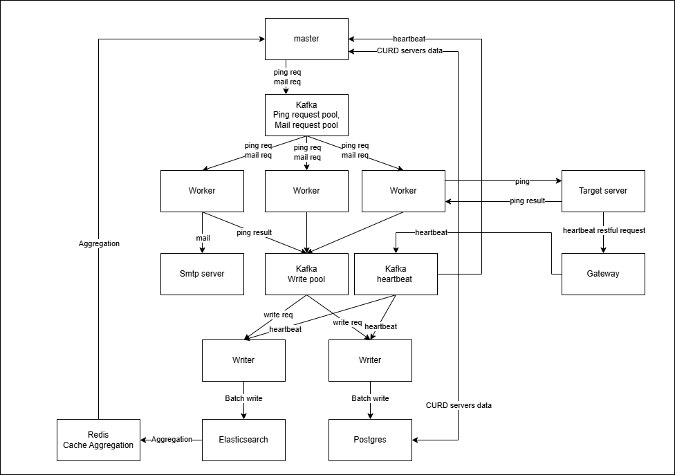
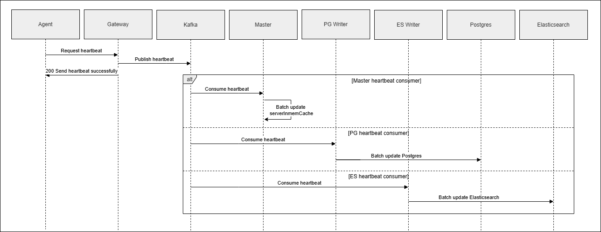
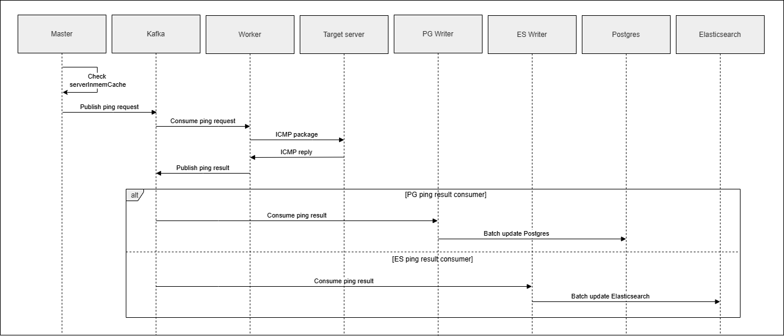
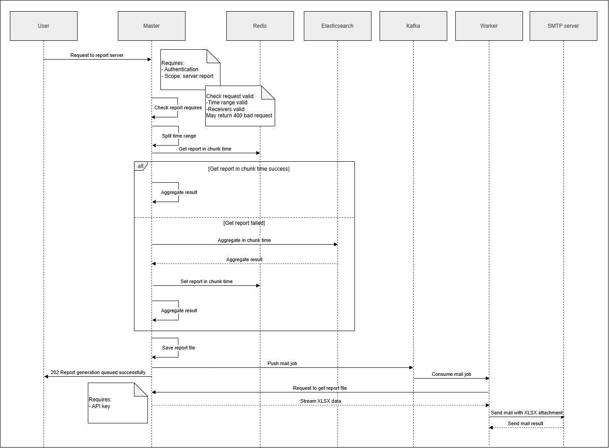

# Server Management System: Project Specification & Documentation

This document serves as the official project documentation. It includes a detailed project description, the system architecture, documentation for **all server API endpoints** with concrete request/response examples, and the technical workflows and scalability rationales for the main use cases: **Server Checking (Passive & Active)** and **Server Reporting with Mail Service**.

---

## 1. Project Overview

The **Server Management System** is a distributed, event-driven infrastructure monitoring solution designed to track the availability and metrics of server fleets.

### Core Features
1.  **Passive Health Tracking (Heartbeats)**: Host servers push REST HTTP heartbeats to a gateway.
2.  **Active Health Verification (ICMP Fallback)**: Scheduled fallbacks execute ICMP ping checks via workers when heartbeats are delayed.
3.  **Timeseries Log Appending**: Events are logged to Elasticsearch for metrics and PostgreSQL for active status.
4.  **Uptime Analytics & Reporting**: Custom XLSX files are compiled and delivered daily to admins via SMTP.

---

## 2. System Architecture

The following block diagram represents the decoupled, event-driven services, queues, and datastores within the system:


### Component Roles
*   **Target Server (Agent)**: Runs `cmd/agent` to transmit passive heartbeats to the Gateway.
*   **Gateway**: The stateless Gin HTTP proxy (`cmd/gw`) that ingests heartbeats and publishes them directly to Kafka.
*   **Kafka Broker**: Isolates web layers from heavy execution workloads using decoupling topics (`heartbeat`, `ping`, `ping_res`, `mail`).
*   **Master API**: The administrative console (`cmd/master`) handling CRUD REST APIs, authentication/authorization, and cron loops.
*   **Worker Pool**: Scalable worker daemons (`cmd/worker`) processing active ICMP checks and email dispatching tasks.
*   **Writers (PGWriter, ESWriter)**: Standalone Go services buffering and batch-writing events to PostgreSQL and Elasticsearch.
*   **Databases**: PostgreSQL (inventory state), Elasticsearch (timeseries log files), and Redis (reporting metrics cache & JWT token blocklist).

---

## 3. Prerequisites

| Requirement | Version | Notes |
|---|---|---|
| Go | ≥ 1.21 | |
| Docker + Docker Compose | ≥ 24 | For running infrastructure |
| Linux OS | — | ICMP ping requires `CAP_NET_RAW` (privileged raw socket — Worker must run as root or with the capability granted) |

---

## 4. Quick Start

### Step 1 — Clone & Configure

```bash
git clone https://github.com/LeHuuHai/server-management
cd server-management

# Copy example config files and fill in your values
cp config/master/.env.master.example  config/master/.env.master
cp config/gw/.env.gw.example          config/gw/.env.gw
cp config/worker/.env.worker.example  config/worker/.env.worker
cp config/pgwriter/.env.pgwriter.example  config/pgwriter/.env.pgwriter
cp config/eswriter/.env.eswriter.example  config/eswriter/.env.eswriter
cp config/agent/.env.agent.example    config/agent/.env.agent
```

### Step 2 — Start Infrastructure

```bash
# Starts PostgreSQL, Redis, Kafka, Elasticsearch
# Also runs DB migrations and Kafka topic + ES index initialisation
docker compose -f docker-compose.core.yaml up -d
```

> Swagger UI is available at **http://localhost:8081** once the stack is up.

### Step 3 — Run Services (each in a separate terminal)

```bash
# Master API (port defined in APP_PORT)
go run ./cmd/master

# Gateway — receives heartbeats from agents (port defined in APP_PORT)
go run ./cmd/gw

# Worker — ICMP pinger + SMTP mail sender (requires root / CAP_NET_RAW)
sudo go run ./cmd/worker

# PGWriter — batch writes ping/heartbeat results to PostgreSQL
go run ./cmd/pgwriter

# ESWriter — batch writes ping/heartbeat events to Elasticsearch
go run ./cmd/eswriter
```

### Step 4 — Register Servers & Run Agents

```bash
# 1. Login to get a JWT token
curl -X POST http://localhost:8080/auth/login \
  -H 'Content-Type: application/json' \
  -d '{"username":"hari","password":"<password>"}'

# 2. Create a server entry
curl -X POST http://localhost:8080/servers \
  -H 'Authorization: Bearer <access_token>' \
  -H 'Content-Type: application/json' \
  -d '{"server_id":"server_00001","server_name":"Web Proxy 1","ipv4":"10.10.10.101"}'

# 3a. Run agent directly
APP_SERVER_ID=server_00001 go run ./cmd/agent

# 3b. OR spin up 10 demo agents via Docker
docker compose -f docker-compose.agent.yaml up -d
```

---

## 5. Project Structure

```
.
├── api/                        # OpenAPI spec (openapi.yaml) + generated Gin handlers
│   └── gw/                     # Generated handlers for the Gateway service
├── cmd/
│   ├── agent/                  # Agent: sends periodic HTTP heartbeats to Gateway
│   ├── eswriter/               # Batch writer → Elasticsearch (consumes heartbeat + ping_res)
│   ├── gw/                     # Gateway: ingests heartbeats, publishes to Kafka
│   ├── master/                 # Main API: CRUD, auth, ping scheduler, daily report cron
│   ├── pgwriter/               # Batch writer → PostgreSQL (consumes heartbeat + ping_res)
│   └── worker/                 # ICMP pinger + SMTP mail sender
├── config/                     # Per-service .env config files and structs
│   ├── agent/
│   ├── common/                 # Shared config types (Postgres, Redis, Kafka, ES)
│   ├── eswriter/
│   ├── gw/
│   ├── master/
│   ├── pgwriter/
│   └── worker/
├── internal/
│   ├── domain/
│   │   ├── aggregator/         # ReportAggregator interface
│   │   ├── auth/               # Role & Scope definitions
│   │   ├── cache/              # ServerMetadataCacheInterface
│   │   ├── file/               # Export & Deserialize interfaces
│   │   ├── mail/               # Sender interface
│   │   ├── mq/                 # Publisher & Consumer interfaces
│   │   ├── repo/               # Repository interfaces (server, account)
│   │   └── service/            # Service interfaces (server, auth, report, gw, batch, download)
│   ├── handler/                # HTTP handlers (ServerHandler, AuthHandler, GwHandler)
│   ├── infra/
│   │   ├── elasticsearch/      # ES aggregator + cached aggregator + bulk writer
│   │   ├── file/               # XLSX export & import implementations
│   │   ├── inmem/              # In-memory server metadata cache (sync.Mutex map)
│   │   ├── jwt/                # JWT provider (access + refresh tokens)
│   │   ├── kafka/              # Kafka publisher & consumer wrappers
│   │   ├── mail/               # gomail SMTP sender
│   │   ├── postgres/           # GORM PostgreSQL repository implementations
│   │   ├── redis/              # Redis token blocklist + daily report cache
│   │   └── runtime/            # Per-service dependency wiring (App structs)
│   ├── middleware/             # Auth (JWT + API Key) & structured logging middleware
│   ├── model/                  # Shared data models (Server, Account, Heartbeat, …)
│   └── service/                # Business logic implementations + batch services
├── migrations/                 # SQL migration files (golang-migrate)
├── mocks/                      # Auto-generated mocks (mockery)
└── scripts/                    # Kafka topic & Elasticsearch index init shell scripts
```

---

## 6. Environment Variables

Each service loads its own `.env` file from `config/<service>/`. Copy the `.example` file and fill in your values.

### Master (`config/master/.env.master`)

| Variable | Description | Example |
|---|---|---|
| `APP_HOST` | Listen address | `0.0.0.0` |
| `APP_PORT` | HTTP port | `8080` |
| `APP_CYCLE_PING` | Active ping scheduler interval (ms) | `5000` |
| `APP_HEARTBEAT_TIMEOUT` | Stale heartbeat threshold before triggering ICMP probe (ms) | `10000` |
| `APP_ADMAIL` | Auto-report daily recipient email | `admin@company.com` |
| `APP_REPORT_KEY` | Shared API key for report file download endpoint | `secret-key` |
| `APP_CORS_ORIGIN` | Comma-separated allowed CORS origins | `http://localhost:3000` |
| `JWT_ACCESS_SECRET` | HMAC secret for signing access tokens | |
| `JWT_REFRESH_SECRET` | HMAC secret for signing refresh tokens | |
| `JWT_ACCESS_EXPIRED` | Access token TTL (seconds) | `900` |
| `JWT_REFRESH_EXPIRED` | Refresh token TTL (seconds) | `604800` |
| `DB_HOST` / `DB_PORT` | PostgreSQL host & port | `localhost` / `5433` |
| `DB_USER` / `DB_PASSWORD` / `DB_DBNAME` | PostgreSQL credentials | |
| `REDIS_URL` | Redis address | `localhost:6379` |
| `REDIS_PASSWORD` | Redis password (leave empty if none) | |
| `REDIS_DB` | Redis logical database index | `0` |
| `KAFKA_BROKER` | Kafka broker address | `localhost:9092` |
| `KAFKA_PING_TOPIC` | Topic name for ping requests | `ping` |
| `KAFKA_MAIL_TOPIC` | Topic name for mail requests | `mail` |
| `KAFKA_HEARTBEAT_TOPIC` | Topic name for heartbeats | `heartbeat` |
| `KAFKA_GROUP_ID` | Kafka consumer group ID for Master | `master-group` |
| `ES_URL` | Elasticsearch URL | `http://localhost:9200` |
| `ES_INDEX` | Elasticsearch index name for server events | `server_events` |

### Gateway (`config/gw/.env.gw`)

| Variable | Description | Example |
|---|---|---|
| `APP_HOST` | Listen address | `0.0.0.0` |
| `APP_PORT` | HTTP port | `8082` |
| `APP_HEARTBEAT_KEY` | API key agents must present in `X-API-Key` header | `secret-key` |
| `KAFKA_BROKER` | Kafka broker address | `localhost:9092` |
| `KAFKA_HEARTBEAT_TOPIC` | Topic to publish heartbeats to | `heartbeat` |

### Worker (`config/worker/.env.worker`)

| Variable | Description | Example |
|---|---|---|
| `APP_NUM_THREAD` | Number of parallel ICMP prober goroutines | `10` |
| `APP_REPORT_URL` | Base URL to download report files from Master | `http://master:8080/report` |
| `APP_REPORT_KEY` | API key matching Master's `APP_REPORT_KEY` | `secret-key` |
| `KAFKA_BROKER` | Kafka broker address | `localhost:9092` |
| `KAFKA_PING_TOPIC` | Topic to consume ping requests from | `ping` |
| `KAFKA_PING_RES_TOPIC` | Topic to publish ping results to | `ping_res` |
| `KAFKA_MAIL_TOPIC` | Topic to consume mail requests from | `mail` |
| `KAFKA_GROUP_ID` | Kafka consumer group ID for Worker | `worker-group` |
| `GOMAIL_ADDR` | SMTP server address | `smtp.gmail.com` |
| `GOMAIL_PORT` | SMTP port | `587` |
| `GOMAIL_FROM` | Sender email address | `noreply@company.com` |
| `GOMAIL_PASSWORD` | SMTP password / app password | |

### Agent (`config/agent/.env.agent`)

| Variable | Description | Example |
|---|---|---|
| `APP_SERVER_ID` | Unique server ID (overrideable via `APP_SERVER_ID` environment variable) | `server_00001` |
| `APP_HEARTBEAT_URL` | Full URL of Gateway heartbeat endpoint | `http://gw:8082/heartbeat` |
| `APP_HEARTBEAT_KEY` | API key matching Gateway's `APP_HEARTBEAT_KEY` | `secret-key` |
| `APP_CYCLE_HEARTBEAT` | Heartbeat send interval (ms) | `3000` |

---

## 7. Kafka Topics Reference

| Topic | Producer | Consumers | Payload model |
|---|---|---|---|
| `heartbeat` | `cmd/gw` | `master`, `pgwriter`, `eswriter` | `Heartbeat{server_id, timestamp}` |
| `ping` | `cmd/master` | `cmd/worker` | `RequestPing{server_id, server_name, ip}` |
| `ping_res` | `cmd/worker` | `pgwriter`, `eswriter` | `ResponsePing{server_id, status, ping_at}` |
| `mail` | `cmd/master` | `cmd/worker` | `RequestMail{mail{to[], subject, attachments[]}}` |

> **Retention policy:** Messages expire after **1 hour** (`KAFKA_LOG_RETENTION_MS=3600000`).
> Worker commits a Kafka offset for `mail` **only after** a successful SMTP send, guaranteeing at-least-once delivery.

---

## 8. Server Endpoints API Specification

All server-related endpoints require JWT authentication using the header `Authorization: Bearer <access_token>` (except heartbeats and file downloads which utilize API Key verification).

### 1. List Servers
*   **Method / Path**: `GET /servers`
*   **Scope Permission Required**: `server:read`
*   **Query Parameters**:
    *   `from` (integer, default: `0`): Pagination offset.
    *   `to` (integer, default: `10`): Pagination limit.
    *   `sort_field` (string, required): Field to sort by (e.g., `server_id`).
    *   `desc` (boolean, required): Sort descending if true.
*   **Example Response (200 OK)**:
    ```json
    {
      "total": 1,
      "items": [
        {
          "server_id": "server_00001",
          "server_name": "Web Proxy 1",
          "ipv4": "10.10.10.101",
          "status": "ON",
          "created_at": "2026-06-08T09:23:46Z",
          "last_ping_at": "2026-06-08T09:48:30Z",
          "metadata_updated_at": "2026-06-08T09:23:46Z"
        }
      ]
    }
    ```

### 2. Create Server
*   **Method / Path**: `POST /servers`
*   **Scope Permission Required**: `server:create`
*   **Request Body**:
    ```json
    {
      "server_id": "server_00012",
      "server_name": "Database Secondary",
      "ipv4": "10.10.10.112"
    }
    ```
*   **Example Response (201 Created)**:
    ```json
    {
      "server_id": "server_00012",
      "server_name": "Database Secondary",
      "ipv4": "10.10.10.112",
      "status": "UNKNOWN",
      "created_at": "2026-06-08T09:54:00Z",
      "last_ping_at": "0001-01-01T00:00:00Z",
      "metadata_updated_at": "2026-06-08T09:54:00Z"
    }
    ```

### 3. Update Server
*   **Method / Path**: `PATCH /servers/{server_id}`
*   **Scope Permission Required**: `server:update`
*   **Request Body**:
    ```json
    {
      "server_name": "Database Secondary Updated",
      "ipv4": "10.10.10.113"
    }
    ```
*   **Example Response (200 OK)**:
    ```json
    {
      "server_id": "server_00012",
      "server_name": "Database Secondary Updated",
      "ipv4": "10.10.10.113",
      "status": "UNKNOWN",
      "created_at": "2026-06-08T09:54:00Z",
      "last_ping_at": "0001-01-01T00:00:00Z",
      "metadata_updated_at": "2026-06-08T09:56:00Z"
    }
    ```

### 4. Delete Server
*   **Method / Path**: `DELETE /servers/{server_id}`
*   **Scope Permission Required**: `server:delete`
*   **Response (204 No Content)**:
    *(Empty body returned on successful deletion)*

### 5. Import Servers (Bulk Creation)
*   **Method / Path**: `POST /servers/import`
*   **Scope Permission Required**: `server:import`
*   **Request Content-Type**: `multipart/form-data`
*   **Payload**: A file field named `file` containing an Excel sheet (`.xlsx`) listing servers.
*   **Example Response (200 OK)**:
    ```json
    {
      "total_success": 2,
      "id_success": ["server_00015", "server_00016"],
      "total_failed": 1,
      "id_failed": ["server_00017"]
    }
    ```

### 6. Export Servers (Bulk Extraction)
*   **Method / Path**: `GET /servers/export?from=0&to=100&sort_field=server_id&desc=false`
*   **Scope Permission Required**: `server:export`
*   **Response Headers**:
    `Content-Disposition: attachment; filename="servers.xlsx"`
*   **Response (200 OK)**:
    *(Streams binary spreadsheet payload `application/vnd.openxmlformats-officedocument.spreadsheetml.sheet`)*

### 7. Generate Server Uptime Report (Async)
*   **Method / Path**: `POST /servers/report`
*   **Scope Permission Required**: `server:report`
*   **Request Body**:
    ```json
    {
      "from": "2026-06-07T00:00:00Z",
      "to": "2026-06-08T00:00:00Z",
      "receivers": ["admin@mycompany.com"]
    }
    ```
*   **Response (202 Accepted)**:
    *(Uptime compilation and SMTP email delivery queued in the background)*

### 8. Download Report File
*   **Method / Path**: `GET /report/{filename}`
*   **Authorization Required**: `X-API-Key` header matching server `ReportKey`
*   **Response (200 OK)**:
    *(Streams binary spreadsheet payload `application/octet-stream`)*

---

## 9. Main Process Flows & Scalability Rationales

This section details how the main system use cases work and the structural choices made to ensure high scalability under heavy system workloads.

---

### Process A: Passive Uptime Checking (Heartbeat Ingestion)

#### 1. Workflow
1.  **Agent Ticker**: Agents (`cmd/agent`) send an HTTP `POST /heartbeat` containing `ServerID` and `Timestamp` at `CycleHeartbeat` intervals to the Gateway (`cmd/gw`).
2.  **API Key Middleware**: Gateway verifies header credentials, maps parameters into JSON, and immediately publishes the heartbeat object to Kafka's `heartbeat` topic.
3.  **Broker Propagation**: Decoupled consumer groups fetch and write events:
    *   `master`: Updates its in-memory status map cache.
    *   `pgwriter`: Consumes from `heartbeat`, groups entries, and bulk-updates Postgres records.
    *   `eswriter`: Consumes from `heartbeat` and bulk-logs timeseries status items into Elasticsearch index.



#### 2. Scalability Rationale: Gateway & Async Bulk Writers
*   **Decoupled HTTP Lifecycle (Gateway)**: Pushing heartbeats from agents directly to database engines within the HTTP response thread creates performance bottlenecks due to database connection pooling and query delays. Decoupling ingestion via Gateway and Kafka ensures heartbeats are ingested in $<5$ milliseconds, removing DB lock/I/O wait-times.
*   **Buffered Micro-Batch Writing**: Establishing separate network writes for thousands of server heartbeats triggers CPU spikes and locks on the database tables. Standalone writer agents (`pgwriter` and `eswriter`) accumulate events in local Go channels. They write in bulk batches (e.g. batch size of 1000/2000 or 1-second timeout), reducing total network handshakes and query overhead by up to 99%.
*   **Shock Absorption & Backpressure**: If PostgreSQL or Elasticsearch slows down or goes offline, the Gateway does not crash. Message payloads safely spool in Kafka topics, waiting for writers to catch up, ensuring zero data loss during traffic spikes or DB updates.

---

### Process B: Active Uptime Checking (Fallback Pinger)

#### 1. Workflow
1.  **Cache Scanning**: The Master runs a routine task scheduler ticker (`CyclePing`). It evaluates the in-memory cache to identify servers that have missed heartbeats past the `HeartbeatTimeout` threshold.
2.  **Check Scheduling**: Master publishes a `RequestPing` payload (ServerID, IP) to the `ping` Kafka topic.
3.  **Distributed Pinger**: Workers (`cmd/worker`) consume `RequestPing` events. They execute a raw socket privileged ICMP echo check (timeout: 1s).
4.  **Result Propagation**: Workers evaluate packet returns, classify the status as `ONLINE` or `OFFLINE`, and publish a `ResponsePing` to `ping_res` Kafka topic.
5.  **Batch Writers**: Decoupled writers consume `ping_res` and bulk-write states back to databases.



#### 2. Scalability Rationale: Cached Checks & Horizontal Worker Pools
*   **Zero-Lookup Cache Checking**: Instead of querying database tables on a loop to scan status timestamps—which is extremely expensive and drains SQL read locks—the Master checks status structures from `ServerInmemCache` in RAM.
*   **Horizontal Execution Scaling**: Network ICMP ping checks require waiting on remote roundtrips (and a 1-second timeout on failure). Running thousands of concurrent pings inside the Master API process would quickly block OS threads. Offloading ping tasks to Kafka-decoupled worker services lets you scale network workers horizontally across multiple host servers.
*   **Asynchronous Database Updates**: Processing ping checks and updating databases are executed as separate processes. Pinger threads push simple metrics blocks to Kafka and return immediately, leaving the database updates to decoupled bulk writers.

---

### Process C: Report Generation & Email Dispatch

#### 1. Workflow
1.  **Request Ingestion**: Admin calls `POST /servers/report` or the Master scheduler triggers the reporting sequence at midnight.
2.  **Uptime Aggregation Query**: The Master checks the `Redis` cache for daily calculations. If not found, it queries `Elasticsearch` for index bucket counts and aggregates the results, then caches the calculations in `Redis`.
3.  **XLSX Export**: Master builds the report spreadsheet locally at `./tmp/report-<uuid>.xlsx` and queues a `RequestMail` message in the `mail` Kafka topic containing only the filename.
4.  **Instant Response**: Master returns `202 Accepted` to the client.
5.  **Worker Pull & SMTP Send**:
    *   The `Worker` consumes the mail request metadata from Kafka.
    *   It executes a secure HTTP `GET /report/{filename}` pull back to the Master API using `ReportKey` authentication to fetch the spreadsheet binary.
    *   It attaches the file and sends the email via SMTP.
    


#### 2. Scalability Rationale: Asynchronous 202 Responses & HTTP Pull Pattern
*   **Asynchronous API Lifecycle (202 Accepted)**: Querying historical metrics, processing spreadsheet creation, and making SMTP socket connections can take seconds or minutes. Keeping HTTP connections open for this duration drains client sockets and web server thread limits. Returning an instant `202 Accepted` frees Master threads immediately.
*   **Kafka Payload Optimization (Pull Pattern)**: Storing large binary spreadsheet attachments directly inside Kafka messages degrades messaging broker memory and throughput. Passing only the filename keeps Kafka events small ($< 1$KB). The worker retrieves the binary payload dynamically via HTTP right before email execution, keeping the broker fast and lean.
*   **Uptime Aggregation Caching**: Querying Elasticsearch for metric aggregates across millions of daily log records is highly compute-intensive. Caching calculated daily summaries in Redis prevents redundant document-count scans on the ES cluster.
